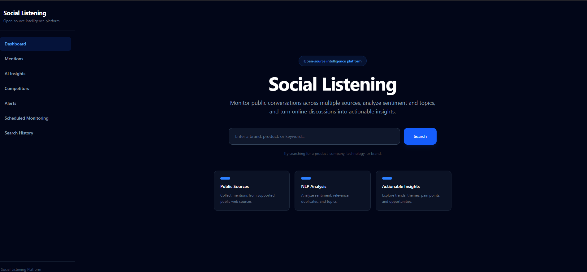
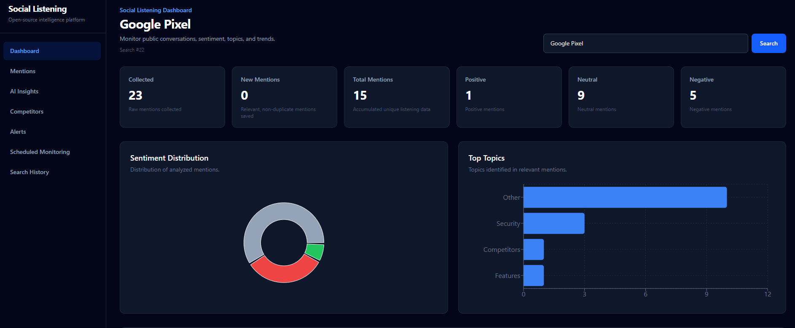
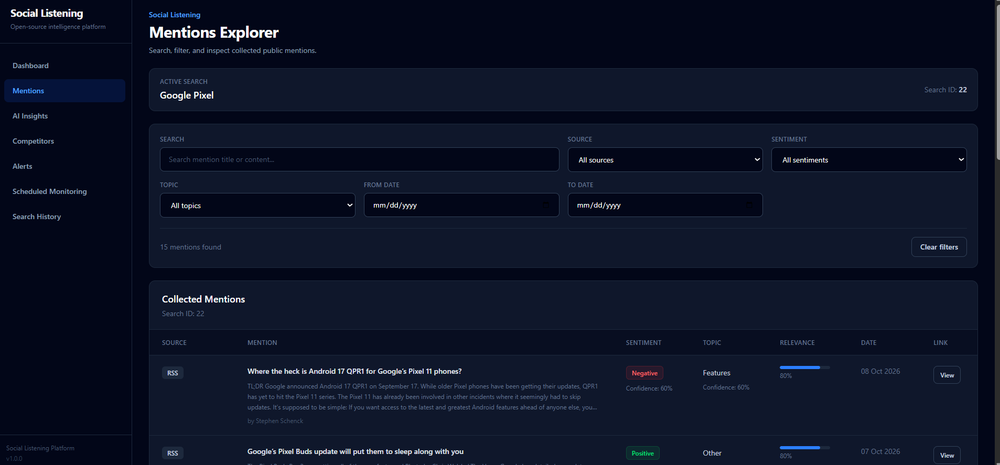
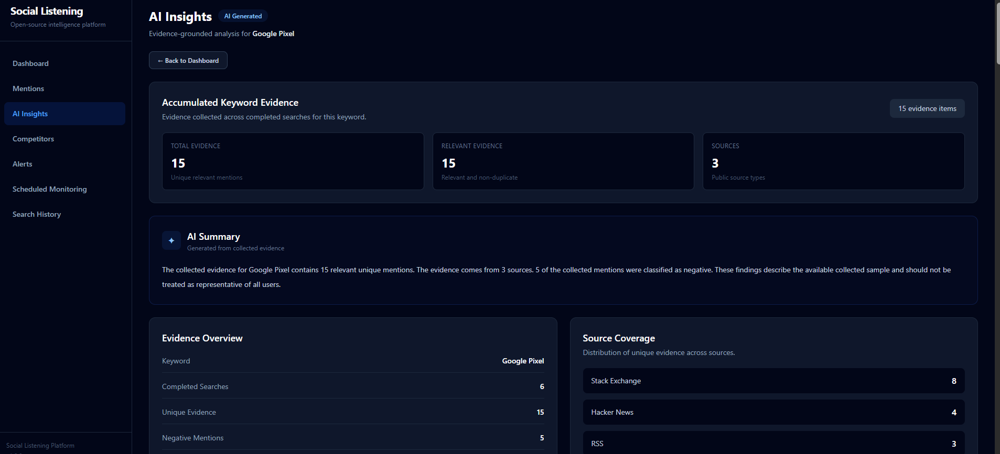
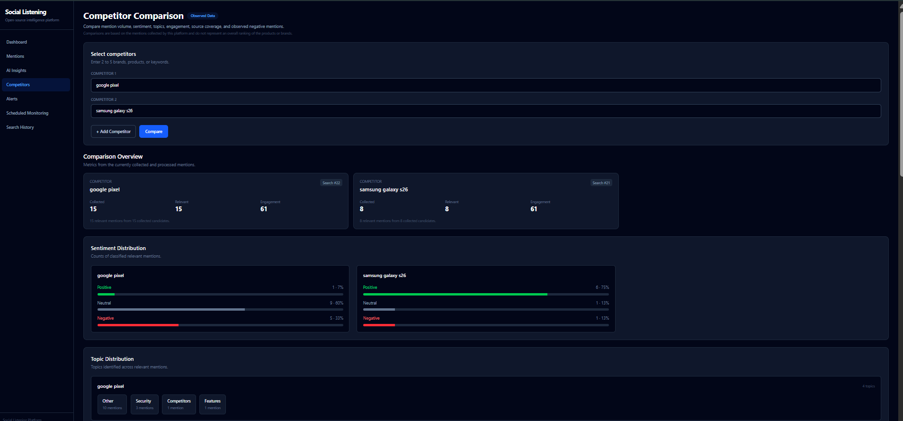
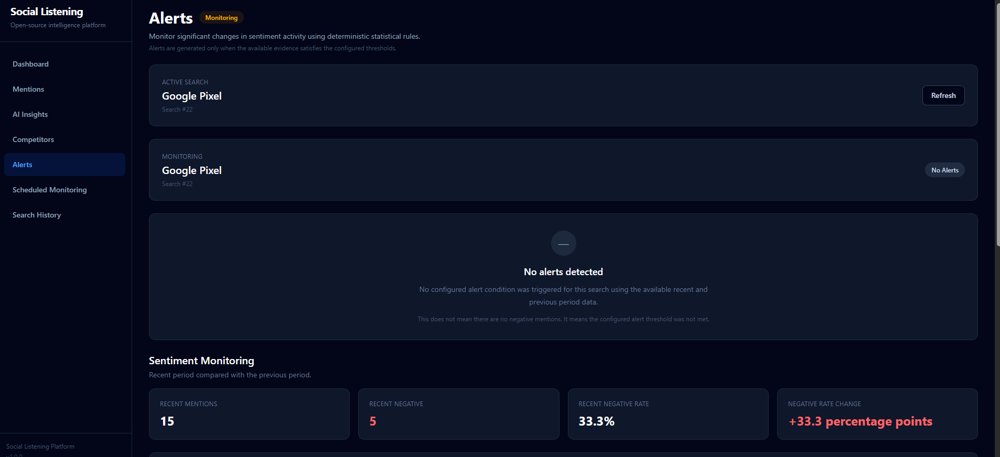
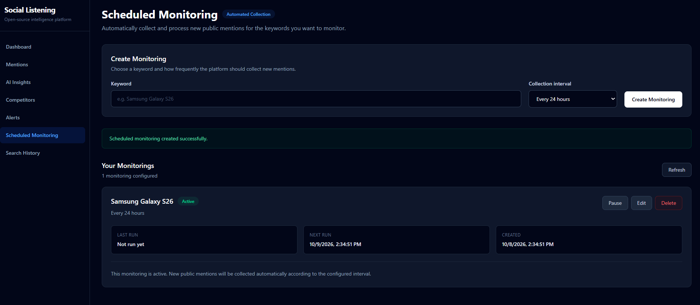
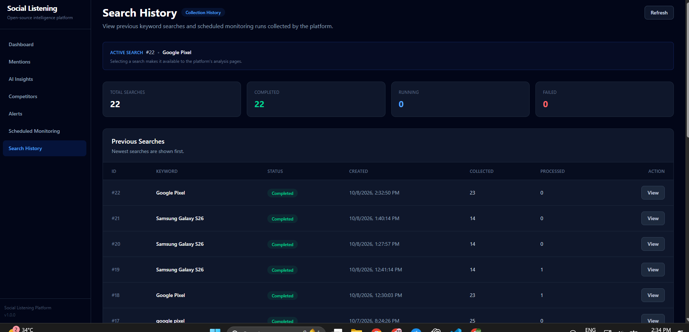

# 🤖 Open-Source Social Listening Platform

An open-source **social listening and mention analysis platform** that collects online mentions from multiple public sources and transforms them into structured insights using **relevance filtering, deduplication, sentiment analysis, topic classification, analytics, competitor comparison, alerts, scheduled monitoring, and AI-assisted insights**.

The platform provides a modern **React dashboard** backed by a **FastAPI REST API** and **PostgreSQL database**, with complete **Docker Compose** support.

---

# 📌 Project Overview

The **Open-Source Social Listening Platform** is designed to help users understand what people are saying online about a product, brand, technology, or keyword.

A user enters a keyword such as:

```text
Samsung Galaxy S26
```

The platform collects relevant content from supported public sources such as **RSS feeds, Hacker News, and Stack Exchange**.

The collected content then passes through a processing pipeline:

```text
Data Collection
      ↓
Normalization
      ↓
Relevance Filtering
      ↓
Deduplication
      ↓
Sentiment Analysis
      ↓
Topic Classification
      ↓
PostgreSQL
      ↓
Analytics / AI Insights / Competitor Analysis / Alerts
      ↓
React Dashboard
```

---

# ✨ Features

- 🔎 Keyword-based social listening
- 📰 Multi-source data collection
- 📡 RSS feed ingestion
- 🟠 Hacker News ingestion
- 💬 Stack Exchange ingestion
- 🎯 Relevance filtering
- ♻️ Mention deduplication
- 😊 Sentiment analysis
- 🏷️ Topic classification
- 📊 Analytics dashboard
- 🤖 AI-assisted insights
- ⚔️ Competitor comparison
- 🔔 Sentiment and activity alerts
- ⏰ Scheduled keyword monitoring
- 📋 Mention explorer
- 📚 Search history
- 🐘 PostgreSQL database
- ⚡ FastAPI REST API
- ⚛️ React + Vite frontend
- 🐳 Docker Compose deployment
- 🧪 Automated backend testing

---

# ⭐ Key Highlights

- Supports multiple public data sources.
- Normalizes different source formats into a common mention structure.
- Filters irrelevant content before deeper processing.
- Removes duplicate mentions.
- Performs sentiment classification with confidence scores.
- Classifies mentions into meaningful topics.
- Provides source, sentiment, topic, and time-based analytics.
- Provides competitor comparison for multiple keywords.
- Includes scheduled monitoring for recurring searches.
- Generates evidence-based AI-assisted insights.
- Includes deterministic fallback logic when structured local LLM output is unavailable.
- Provides a complete Dockerized development environment.
- Backend automated test suite currently has **24/24 tests passing**.

---

# 🛠 Technology Stack

## Frontend

- React
- Vite
- JavaScript
- CSS
- Axios / REST API integration
- ESLint

## Backend

- Python
- FastAPI
- Uvicorn
- SQLAlchemy
- Pydantic
- Alembic

## Database

- PostgreSQL

## Data Collection

- RSS
- Hacker News
- Stack Exchange

Configured RSS sources include:

- TechCrunch
- The Verge
- Ars Technica
- Android Authority

## NLP & AI

- Sentence Transformers
- Hugging Face Transformers
- Sentiment classification
- Embedding-based topic classification
- Local LLM / AI-assisted insight generation

## DevOps

- Docker
- Docker Compose
- Nginx

## Testing

- Pytest

---

# 📂 Project Structure

```text
social-listening-platform/
│
├── backend/
│   ├── app/
│   │   ├── api/
│   │   │   ├── alerts.py
│   │   │   ├── analytics.py
│   │   │   ├── competitors.py
│   │   │   ├── insights.py
│   │   │   ├── mentions.py
│   │   │   ├── monitorings.py
│   │   │   └── searches.py
│   │   │
│   │   ├── collectors/
│   │   │   ├── base.py
│   │   │   ├── hackernews.py
│   │   │   ├── models.py
│   │   │   ├── reddit.py
│   │   │   ├── rss.py
│   │   │   └── stackexchange.py
│   │   │
│   │   ├── database/
│   │   │   ├── connection.py
│   │   │   └── models.py
│   │   │
│   │   ├── schemas/
│   │   │
│   │   └── services/
│   │       ├── ai_insights_service.py
│   │       ├── alert_service.py
│   │       ├── analytics_service.py
│   │       ├── competitor_service.py
│   │       ├── deduplication_service.py
│   │       ├── ingestion_service.py
│   │       ├── llm_service.py
│   │       ├── mention_service.py
│   │       ├── normalization_service.py
│   │       ├── processing_service.py
│   │       ├── relevance_service.py
│   │       ├── scheduler_service.py
│   │       ├── search_persistence_service.py
│   │       ├── search_recovery_service.py
│   │       ├── search_service.py
│   │       ├── sentiment_service.py
│   │       └── topic_service.py
│   │
│   ├── alembic/
│   ├── evaluation/
│   ├── tests/
│   ├── create_tables.py
│   ├── pytest.ini
│   ├── requirements.txt
│   └── Dockerfile
│
├── frontend/
│   ├── public/
│   ├── src/
│   │   ├── components/
│   │   ├── context/
│   │   ├── pages/
│   │   └── services/
│   ├── Dockerfile
│   ├── nginx.conf
│   ├── package.json
│   └── vite.config.js
│
├── .env.example
├── .gitignore
├── ARCHITECTURE.md
├── docker-compose.yml
└── README.md
```

---

# 🚀 Installation

## Clone Repository

```bash
git clone https://github.com/MdNvD/social-listening-platform.git
```

```bash
cd social-listening-platform
```

---

# 🐳 Run with Docker

Docker Compose is the recommended way to run the complete application.

```bash
docker compose up -d --build
```

Check the running containers:

```bash
docker compose ps
```

Stop the application:

```bash
docker compose down
```

### Application URLs

Frontend:

```text
http://localhost:8090
```

Backend:

```text
http://127.0.0.1:8000
```

FastAPI Swagger documentation:

```text
http://127.0.0.1:8000/docs
```

PostgreSQL is exposed locally through port:

```text
5434
```

---

# 💻 Manual Installation

## Backend Setup

```powershell
cd backend

python -m venv venv

venv\Scripts\activate

pip install -r requirements.txt
```

Configure your environment using the provided:

```text
.env.example
```

Run the backend:

```powershell
uvicorn app.main:app --reload
```

Backend:

```text
http://127.0.0.1:8000
```

Swagger:

```text
http://127.0.0.1:8000/docs
```

---

## Frontend Setup

Open another terminal:

```powershell
cd frontend

npm install

npm run dev
```

Frontend:

```text
http://localhost:5173
```

---

# 🔄 Application Workflow

```text
Enter Keyword
      │
      ▼
Create Search
      │
      ▼
Collect Online Mentions
      │
      ├───────────────┐
      │               │
      ▼               ▼
     RSS        Hacker News
      │               │
      └───────┬───────┘
              │
              ▼
       Stack Exchange
              │
              ▼
       Normalize Data
              │
              ▼
    Relevance Filtering
              │
              ▼
       Deduplication
              │
              ▼
      Sentiment Analysis
              │
              ▼
     Topic Classification
              │
              ▼
        PostgreSQL
              │
       ┌──────┼─────────┐
       │      │         │
       ▼      ▼         ▼
   Analytics Insights Competitors
       │      │         │
       └──────┼─────────┘
              │
              ▼
        React Dashboard
```

---

# 📡 Data Sources

## RSS

The RSS collector retrieves articles from configured feeds.

Current configured sources include:

- TechCrunch
- The Verge
- Ars Technica
- Android Authority

## Hacker News

The Hacker News collector retrieves technology-related discussions and processes them for relevance and analysis.

## Stack Exchange

The Stack Exchange collector retrieves relevant community questions and discussions.

---

# 🎯 Relevance Filtering

The relevance service determines whether collected content is actually related to the searched keyword.

Example:

```text
Keyword:
Samsung Galaxy S26

Relevant:
"Samsung Galaxy S26 review and specifications"

Not Relevant:
"Samsung washing machine review"
```

Only relevant mentions continue through the processing pipeline.

---

# ♻️ Deduplication

The deduplication service prevents the same mention from being stored multiple times.

Duplicate detection can consider:

- URL similarity
- Content similarity
- Product/model context
- Existing database records

Example:

```text
Article A
https://example.com/article

Article B
https://example.com/article

        ↓

Duplicate detected

        ↓

Stored once
```

---

# 😊 Sentiment Analysis

Every processed mention can be classified as:

```text
Positive
Neutral
Negative
```

The platform also stores sentiment confidence.

Example:

```text
Sentiment:
Positive

Confidence:
0.91
```

Sentiment data is used by:

- Analytics
- Alerts
- AI Insights
- Competitor Comparison

---

# 🏷️ Topic Classification

Mentions are classified into topics such as:

```text
Pricing
Features
Competitors
Security
Other
```

Example:

```text
"Galaxy S26 is cheaper than expected"

        ↓

Topic: Pricing
```

Topic confidence is also stored for analyzed mentions.

---

# 📊 Analytics

The analytics system provides:

- Total mentions
- Sentiment distribution
- Topic distribution
- Source distribution
- Mentions over time
- First mention timestamp
- Latest mention timestamp

Example development result:

```text
Total Mentions: 8

Sentiment:
Positive: 6
Negative: 1
Neutral: 1

Topics:
Competitors: 4
Pricing: 2
Features: 1
Other: 1
```

These values are example development/test results and change as new data is collected.

---

# 🤖 AI Insights

The AI Insights module analyzes processed mention data and generates higher-level observations.

It can provide:

- Overall summary
- Positive observations
- Negative observations
- Pain points
- Opportunities
- Recommended actions
- Supporting evidence

Workflow:

```text
Processed Mentions
        │
        ▼
Evidence Collection
        │
        ▼
Statistical Analysis
        │
        ▼
AI / Local LLM
        │
        ▼
Structured Insights
        │
        ▼
React Dashboard
```

When the local LLM does not return usable structured JSON, the application can use deterministic evidence-based fallback logic.

---

# ⚔️ Competitor Comparison

The platform can compare multiple keywords or products.

Example:

```text
Samsung Galaxy S26
        VS
Google Pixel
```

Comparison metrics include:

- Total mentions
- Sentiment
- Topics
- Sources
- Engagement
- Negative mentions

---

# 🔔 Alerts

The alerts module analyzes recent mention activity.

It can evaluate:

- Recent mention volume
- Recent negative mentions
- Negative sentiment rate
- Changes compared with a previous period

Example:

```text
Recent Period
      │
      ▼
Negative Mentions
      │
      ▼
Negative Rate
      │
      ▼
Previous Period Comparison
      │
      ▼
Alert Evaluation
```

---

# ⏰ Scheduled Monitoring

Users can create recurring monitoring jobs for keywords.

Example:

```text
Keyword:
Samsung Galaxy S26

Interval:
1440 minutes

        ↓

Scheduled Search
        ↓
Collect Mentions
        ↓
Process Mentions
        ↓
Update Database
```

Monitoring supports:

- Create
- Retrieve
- Update
- Activate / deactivate
- Delete

---

# 🌐 API Endpoints

| Method | Endpoint | Description |
|---|---|---|
| GET | `/api/health` | Check backend health |
| POST | `/api/searches` | Create a keyword search |
| GET | `/api/searches/{search_id}` | Get search information |
| GET | `/api/searches/{search_id}/mentions` | Get collected mentions |
| GET | `/api/searches/{search_id}/analytics` | Get analytics |
| GET | `/api/searches/{search_id}/insights` | Get AI-assisted insights |
| POST | `/api/competitors/compare` | Compare keywords/products |
| GET | `/api/searches/{search_id}/alerts` | Get alerts |
| GET | `/api/monitorings` | List monitoring jobs |
| POST | `/api/monitorings` | Create monitoring |
| GET | `/api/monitorings/{monitoring_id}` | Get monitoring |
| PATCH | `/api/monitorings/{monitoring_id}` | Update monitoring |
| DELETE | `/api/monitorings/{monitoring_id}` | Delete monitoring |

Interactive API documentation:

```text
http://127.0.0.1:8000/docs
```

---

# 🗄️ Database

The application uses PostgreSQL for persistent storage.

Main database tables include:

```text
searches
mentions
mention_analysis
```

Database migrations are managed using Alembic.

Example:

```bash
alembic upgrade head
```

---

# 🧪 Testing

The official automated backend tests are located in:

```text
backend/tests/
```

Run:

```powershell
cd backend
pytest -v
```

Current result:

```text
24 passed
```

The test suite covers:

- Deduplication
- Relevance filtering
- Sentiment analysis
- Topic classification

Additional development and evaluation scripts are stored in:

```text
backend/evaluation/
```

---

# 🐳 Docker Architecture

```text
┌─────────────────────────────────────────────┐
│              Docker Compose                 │
│                                             │
│   ┌─────────────────────────────────────┐   │
│   │ Frontend                            │   │
│   │ React + Vite + Nginx                │   │
│   │ localhost:8090                      │   │
│   └─────────────────┬───────────────────┘   │
│                     │                       │
│                     ▼                       │
│   ┌─────────────────────────────────────┐   │
│   │ Backend                             │   │
│   │ FastAPI + Uvicorn                   │   │
│   │ localhost:8000                      │   │
│   └─────────────────┬───────────────────┘   │
│                     │                       │
│                     ▼                       │
│   ┌─────────────────────────────────────┐   │
│   │ PostgreSQL                          │   │
│   │ localhost:5434                      │   │
│   └─────────────────────────────────────┘   │
│                                             │
└─────────────────────────────────────────────┘
```

---

# 🔐 Environment Configuration

Sensitive environment files are not committed to Git.

Use:

```text
.env.example
```

as the configuration template.

Local files such as:

```text
.env
venv/
node_modules/
dist/
__pycache__/
.pytest_cache/
```

are excluded through `.gitignore`.

---

# 📸 Screenshots

## 🏠 Landing Page



---

## 📊 Dashboard



---

## 📋 Mentions Explorer



---

## 🤖 AI Insights



---

## ⚔️ Competitor Comparison



---

## 🔔 Alerts



---

## ⏰ Scheduled Monitoring



---

## 📚 Search History



---

# 🎯 Project Status

## Completed

- ✅ RSS data collection
- ✅ Hacker News collection
- ✅ Stack Exchange collection
- ✅ Data normalization
- ✅ Relevance filtering
- ✅ Deduplication
- ✅ Sentiment analysis
- ✅ Topic classification
- ✅ PostgreSQL persistence
- ✅ Analytics
- ✅ AI-assisted insights
- ✅ Competitor comparison
- ✅ Alerts
- ✅ Scheduled monitoring
- ✅ Search history
- ✅ React dashboard
- ✅ Docker Compose
- ✅ Backend API validation
- ✅ Automated backend testing
- ✅ GitHub repository

### Test Status

```text
24 / 24 backend tests passing
```

---

# 🚀 Future Enhancements

- Additional social/community data sources
- Real-time data ingestion
- Advanced trend detection
- Historical sentiment tracking
- More advanced alert rules
- User authentication
- Role-based access control
- Background task queues
- Redis caching
- Cloud deployment
- CI/CD pipeline
- Production monitoring
- Advanced LLM insights
- API rate limiting
- Horizontal scaling

---

# 👨‍💻 Author

**Mohamed Navith**

B.Tech – Computer Science and Engineering

Passionate about:

- Full Stack Development
- Python
- Artificial Intelligence
- Machine Learning
- Cloud Computing
- DevOps

---

# 📜 License

This project is developed as an **open-source internship project**.

A separate open-source license can be added to the repository when the licensing terms are finalized.

---

# ⭐ Support

If you find this project useful, consider giving the repository a ⭐ on GitHub.

Repository:

```text
https://github.com/MdNvD/social-listening-platform
```
